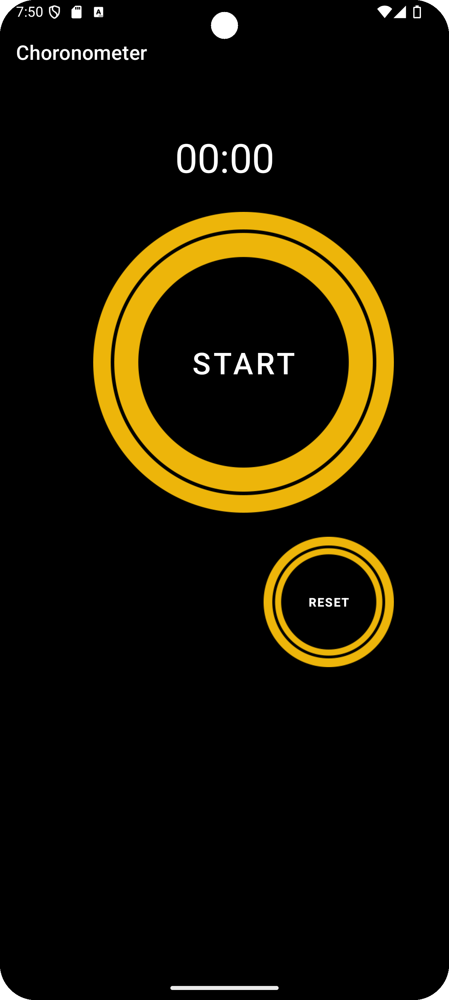
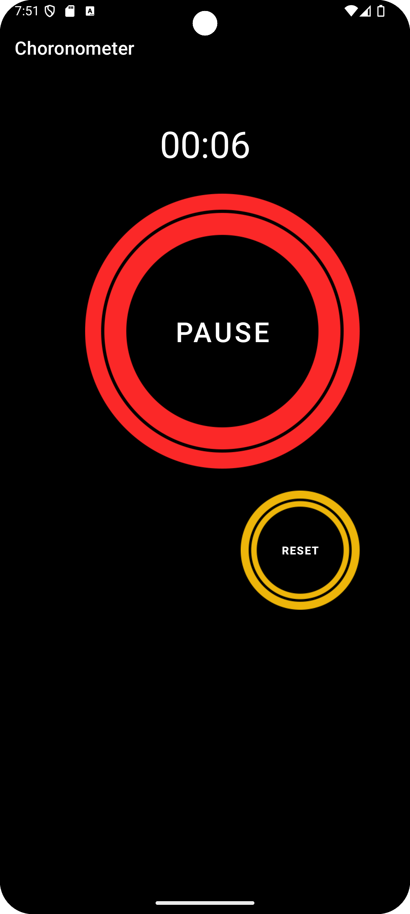

# Simple Stopwatch Application

This is a very basic stopwatch application coded in Java. The project is intended as a learning tool for understanding mobile programming. It showcases fundamental concepts of app development with a simple stopwatch functionality.

## Preview

**Homepage:**

**Chronometer Start:**

## Features

- **Start Stopwatch**: Begins the stopwatch.
- **Stop Stopwatch**: Halts the stopwatch.
- **Reset Stopwatch**: Resets the stopwatch to zero.

## Requirements

- Java Development Kit (JDK)
- Android Studio or any Java IDE for running the application

## License

This project is licensed under the MIT License - see the [LICENSE](LICENSE) file for details.
